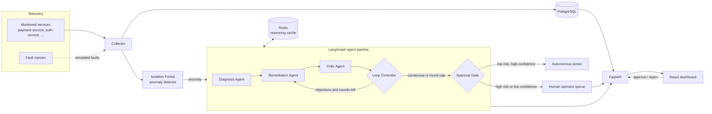

# Agentic CloudOps

**An autonomous Site Reliability Engineering (SRE) system that detects anomalies in microservices with machine learning and resolves them through a guarded, multi-agent LLM pipeline.**


---

## Table of Contents

1. [Overview](#overview)
2. [Key Features](#key-features)
3. [How It Works](#how-it-works)
4. [Architecture](#architecture)
5. [The Agents](#the-agents)
6. [Autonomy Policy and Human-in-the-Loop](#autonomy-policy-and-human-in-the-loop)
7. [Tech Stack](#tech-stack)
8. [Project Structure](#project-structure)
9. [Prerequisites](#prerequisites)
10. [Getting Started](#getting-started)
11. [Configuration](#configuration)
12. [Fault Injection and Demo Walkthrough](#fault-injection-and-demo-walkthrough)
13. [Makefile Reference](#makefile-reference)
14. [Infrastructure Services](#infrastructure-services)
15. [Caching and API Quota](#caching-and-api-quota)
16. [Design Decisions](#design-decisions)
17. [Troubleshooting](#troubleshooting)
18. [License](#license)

---

## Overview

In production, incident response is slow and repetitive: an alert fires, an on-call engineer reads dashboards, forms a hypothesis, picks a fix, and hopes it does not make things worse. Agentic CloudOps automates that loop while keeping a human in control of anything risky.

The system continuously watches service telemetry (CPU, memory, restarts, error rate), flags anomalies with an **Isolation Forest** model, and hands each incident to a **team of specialised LLM agents** that diagnose the root cause, propose a Kubernetes-style remediation, and critique that proposal before anything is applied. Low-risk, high-confidence fixes proceed autonomously. High-risk actions (such as a rollback) or low-confidence decisions are **escalated to a human operator** through an approval queue on a live React dashboard.

> The goal is not "let the LLM run production". It is to make the LLM's proposals **reviewable, bounded, and escalatable**.

---

## Key Features

| Capability | Description |
|---|---|
| **ML anomaly detection** | An Isolation Forest model monitors live telemetry and flags anomalies dynamically, so there are no rigid static thresholds to tune per service. |
| **Multi-agent pipeline** | A LangGraph workflow routes each incident through Diagnosis, Remediation, and Critic agents powered by Google Gemini. |
| **Debate loop with consensus** | Agents iterate until they agree or a hard round cap is reached, which prevents endless back-and-forth. |
| **Risk-tiered approval gate** | High-risk actions and low-confidence decisions are automatically escalated to a human operator. |
| **Live dashboard** | Real-time telemetry charts, a streaming agent reasoning feed, and an operator escalation queue. |
| **Built-in fault injection** | One-command simulation of CPU spikes, memory leaks, and crash loops to exercise the whole pipeline. |
| **LLM response caching** | Redis caches reasoning output for one hour to conserve API quota. |
| **API key rotation** | Supply multiple Gemini keys and the backend rotates through them when rate limits hit. |

---

## How It Works

1. **Collect.** Telemetry for each monitored service (CPU, memory, restarts, error rate) is collected and stored.
2. **Detect.** The Isolation Forest scores incoming telemetry against a learned baseline and flags outliers as anomalies.
3. **Open an incident.** A flagged anomaly becomes an incident and enters the agent pipeline.
4. **Diagnose.** The Diagnosis Agent analyses the telemetry and identifies the likely root cause.
5. **Propose.** The Remediation Agent proposes a Kubernetes-style action such as scale up, restart, or rollback.
6. **Critique.** The Critic Agent reviews the proposal for safety and effectiveness and either approves it or sends it back with objections.
7. **Loop.** The Loop Controller repeats steps 5 and 6 until consensus is reached or the maximum round cap is hit.
8. **Gate.** The Approval Gate decides whether the action is safe to run autonomously or must go to a human.
9. **Observe.** Every step of the agents' reasoning streams to the dashboard, where operators can also approve or reject escalations.

---

## Architecture



### Request and data flow

- **PostgreSQL** stores telemetry, incidents, and agent decisions (accessed through SQLAlchemy).
- **Redis** caches LLM reasoning keyed per incident so repeated identical incidents do not burn API quota.
- **FastAPI** exposes the backend on port `8000` and feeds the dashboard.
- **React + Vite** serves the operator UI on port `5173`.

---

## The Agents

The pipeline is built with **LangGraph** on top of **LangChain**, using **Google Gemini** as the underlying model.

### Diagnosis Agent
Reads the anomalous telemetry window and reasons about the root cause. It answers "what is actually wrong?" (for example, sustained CPU saturation versus a memory leak versus a crash loop) before any fix is considered.

### Remediation Agent
Takes the diagnosis and proposes a concrete, Kubernetes-style remediation: scale up, restart, rollback, and similar. It also reports its confidence in the proposal.

### Critic Agent
An adversarial reviewer. It evaluates the proposal for **safety** (could this make the outage worse?) and **effectiveness** (does it address the diagnosed cause?). Objections are fed back to the Remediation Agent.

### Loop Controller
Owns the debate. It stops the loop as soon as the Critic and Remediation agents reach consensus, or when the maximum round cap is hit, so cost and latency stay bounded even when the agents disagree.

---

## Autonomy Policy and Human-in-the-Loop

Not every fix deserves the same level of trust. The Approval Gate applies a risk-tiered policy:

| Situation | Outcome |
|---|---|
| Low-risk action with high confidence and consensus | Executed autonomously |
| High-risk action (for example, **rollback**) | Escalated to a human operator |
| Low-confidence decision, or no consensus within the round cap | Escalated to a human operator |

Escalated incidents appear in the **operator escalation queue** on the dashboard, alongside the full agent reasoning that led to the recommendation, so the human decides with context rather than blind.

---

## Tech Stack

| Layer | Technology |
|---|---|
| Backend | Python, FastAPI, SQLAlchemy, LangChain, LangGraph |
| Frontend | React, TypeScript, Vite, Chart.js |
| Machine learning | scikit-learn (Isolation Forest) |
| Data and cache | PostgreSQL 16, Redis 7 |
| LLM | Google Gemini |
| Tooling | Docker / Podman Compose, GNU Make |

---

## Project Structure

```text
k8s-remediation/
├── backend/            # FastAPI app, agents, ML detector, DB layer, telemetry collector
│   ├── main.py         # FastAPI entrypoint (served by uvicorn on :8000)
│   ├── database/       # DB models and seeding (seed.py loads baseline telemetry)
│   └── collector/      # Telemetry collection and fault_injector.py
├── frontend/           # React + TypeScript + Vite dashboard
├── config/             # Configuration files
├── k8s-demo/           # Kubernetes demo manifests
├── scripts/            # Helper scripts
├── docker-compose.yml  # PostgreSQL + Redis
├── Makefile            # Shortcuts: run, fault injection, cleanup
├── requirements.txt    # Python dependencies
└── README.md
```

---

## Prerequisites

- **Python** 3.10 or newer
- **Node.js** 18 or newer
- **Docker** or **Podman** (with Compose) for PostgreSQL and Redis
- A **Google Gemini API key** ([get one from Google AI Studio](https://aistudio.google.com/))
- **GNU Make** (for the shortcut commands)

---

## Getting Started

### 1. Clone the repository

```bash
git clone https://github.com/Conceal34/k8s-remediation.git
cd k8s-remediation
```

### 2. Set environment variables

Create a `.env` file in the project root:

```env
GEMINI_API_KEY=your_gemini_api_key_here
```

To rotate across several keys when you hit rate limits, use a comma-separated list instead:

```env
GEMINI_API_KEYS=key_one,key_two,key_three
```

### 3. Start infrastructure (PostgreSQL and Redis)

```bash
docker-compose up -d
```

With Podman, use `podman-compose up -d`. Both services define health checks, so you can confirm they are ready with `docker-compose ps`.

### 4. Set up and start the backend

```bash
python3 -m venv .venv
source .venv/bin/activate
pip install -r requirements.txt

make backend
```

`make backend` first seeds baseline telemetry (used to fit the anomaly model) and then launches the FastAPI server at **http://localhost:8000**.

### 5. Start the frontend

In a second terminal:

```bash
cd frontend
npm install
make frontend
```

If you are inside `frontend/` and `make` cannot find the target, run `npm run dev` instead, or run `make frontend` from the repo root. The dashboard is served at **http://localhost:5173**.

---

## Configuration

| Variable | Required | Description |
|---|---|---|
| `GEMINI_API_KEY` | Yes (or `GEMINI_API_KEYS`) | Single Gemini API key. |
| `GEMINI_API_KEYS` | Optional | Comma-separated list of keys. Enables automatic key rotation on rate limits. |

**Default local service endpoints**

| Service | Address | Credentials |
|---|---|---|
| Backend API | `http://localhost:8000` | none |
| Frontend | `http://localhost:5173` | none |
| PostgreSQL | `localhost:5432` | user `cloudops`, database `cloudops_db` |
| Redis | `localhost:6379` (db `0`) | none |

> These credentials are development defaults from `docker-compose.yml`. Change them and do not expose these ports publicly before deploying anywhere real.

---

## Fault Injection and Demo Walkthrough

The project ships with a fault injector so you can watch the full pipeline react without waiting for a real outage.

### Inject a fault

```bash
make inject-cpu       # Simulates a CPU spike
make inject-memory    # Simulates a memory leak
make inject-crash     # Simulates a crash loop (high error rate and restarts)
```

By default faults target `payment-service`. Target another service with:

```bash
make inject-cpu SERVICE=auth-service
```

### Suggested demo flow

1. Start the infrastructure, backend, and frontend as described above.
2. Open the dashboard at `http://localhost:5173` and confirm telemetry is flowing normally.
3. Run `make inject-cpu`.
4. Watch the CPU chart for `payment-service` diverge from its baseline; the Isolation Forest flags an anomaly.
5. Follow the **agent reasoning feed** as the Diagnosis, Remediation, and Critic agents work through the incident.
6. Observe the outcome: a low-risk action is applied autonomously, while a high-risk or low-confidence one lands in the **escalation queue** for you to approve or reject.
7. Run `make reset` to clear faults and the reasoning cache, then try `make inject-memory` or `make inject-crash` for different behaviour.

### Clean up and reset

```bash
make clean        # Clear active faults; telemetry returns to normal
make flush-cache  # Clear the Gemini reasoning cache in Redis
make reset        # clean + flush-cache
```

---

## Makefile Reference

| Target | What it does |
|---|---|
| `make backend` | Seeds baseline telemetry, then starts the FastAPI server on port 8000 (access logs disabled). |
| `make frontend` | Starts the Vite dev server (`npm run dev` inside `frontend/`). |
| `make inject-cpu` | Injects a CPU spike fault. |
| `make inject-memory` | Injects a memory-leak fault. |
| `make inject-crash` | Injects a crash-loop fault. |
| `make clean` | Removes all active injected faults. |
| `make flush-cache` | Deletes all `cache:incident:*` keys from Redis. |
| `make reset` | Runs `clean` and `flush-cache`. |

All `inject-*` targets accept `SERVICE=<name>` (default: `payment-service`).

---

## Infrastructure Services

`docker-compose.yml` starts two containers, each with a health check and `restart: unless-stopped`:

- **PostgreSQL 16 (alpine):** persistent storage on the `pgdata` named volume; exposed on `5432`.
- **Redis 7 (alpine):** capped at `128mb` with an `allkeys-lru` eviction policy, which suits a cache; exposed on `6379`.

Stop them with `docker-compose down` (add `-v` to also delete the PostgreSQL volume).

---

## Caching and API Quota

LLM calls are the slowest and most rate-limited part of the pipeline, so reasoning output is cached in Redis under `cache:incident:*` keys for **one hour**. Repeated identical incidents (common while demoing) are served from the cache instead of calling Gemini again.

If you change agent prompts or logic and want fresh reasoning, run `make flush-cache`. If you still hit rate limits, provide multiple keys via `GEMINI_API_KEYS`.

---

## Design Decisions

- **Isolation Forest over static thresholds.** Services differ in what "normal" looks like. An unsupervised model learns a baseline per deployment and needs no labelled incidents.
- **Separate agents instead of one big prompt.** Splitting diagnosis, remediation, and critique gives each step a focused job and makes the reasoning inspectable in the UI.
- **A critic in the loop.** A dedicated reviewer catches unsafe or ineffective proposals before they reach an action, instead of trusting a single model's first answer.
- **Hard round cap.** The debate always terminates, which bounds latency, cost, and behaviour under disagreement.
- **Escalate by default when unsure.** Risk and confidence, not convenience, decide what runs autonomously. Rollbacks and low-confidence outcomes always reach a human.
- **Cache LLM reasoning.** It keeps demos fast and free-tier quotas intact.

---

## Troubleshooting

| Problem | Likely cause and fix |
|---|---|
| `make backend` fails with `.venv/bin/python3: No such file` | The Makefile expects a virtual environment at `.venv/`. Create it with `python3 -m venv .venv` and install requirements first. |
| Cannot connect to PostgreSQL or Redis | Containers are not running or not healthy. Run `docker-compose up -d` and check `docker-compose ps`. |
| Port already in use (`8000`, `5173`, `5432`, `6379`) | Stop the conflicting process or change the port mapping. |
| Gemini rate-limit or quota errors | Provide several keys via `GEMINI_API_KEYS`, or wait and rely on the one-hour cache. |
| Dashboard shows no data | Confirm the backend is running on `:8000` and that seeding completed on first start. |
| Stale or repeated agent output | Run `make flush-cache` to clear cached reasoning. |
| Faults linger after a demo | Run `make clean` (or `make reset`). |

---

## Author

**Vinner Hooda** · [GitHub](https://github.com/Conceal34) · [Portfolio](https://vinner-portfolio.netlify.app)
